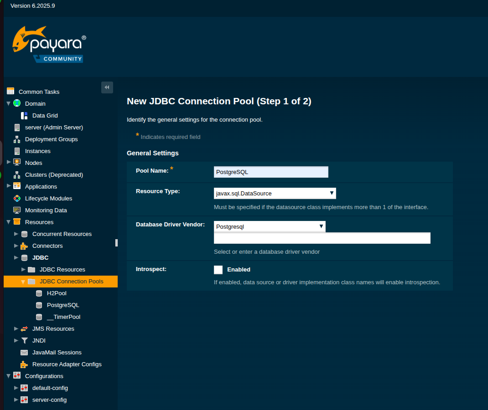
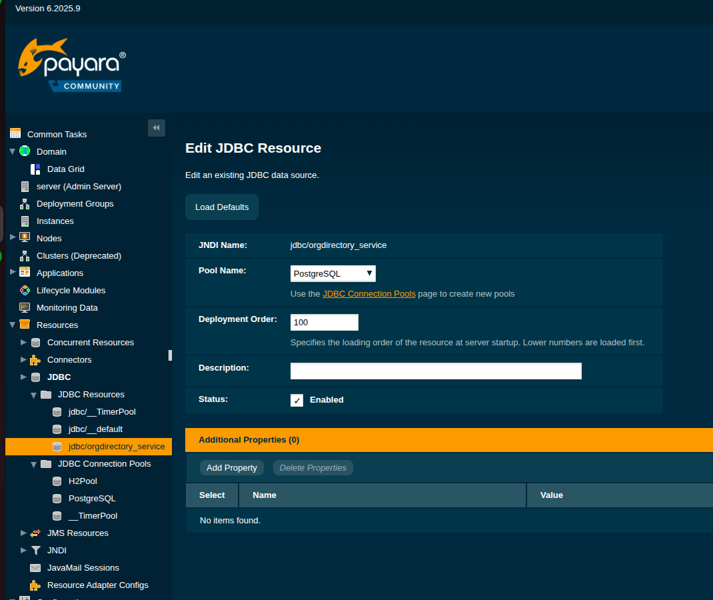

# Как развернуть локально
___

1. Для начала необходимо установить себе payara локально и распаковать в удобную директорию. Также для удобства создадим для неё переменную окружения.  

```
wget https://repo1.maven.org/maven2/fish/payara/distributions/payara/6.2025.9/payara-6.2025.9.zip
unzip payara-6.2025.9.zip
export PAYARA_HOME=../../payara6
```

2. Для запуска сервера воспользуемся следующей командой  

```
${PAYARA_HOME}/bin/asadmin start-domain domain1
```

3. Чтобы запущенные через payara приложения могли корректно подключаться к PostgreSQL передадим ей .jar файл нашего JDBC-драйвера  
```
wget https://repo1.maven.org/maven2/org/postgresql/postgresql/42.7.8/postgresql-42.7.8.jar
mv postgresql-42.7.8.jar $PAYARA_HOME/glassfish/lib
```

После этого payara будет доступна на порту 4848

4. Перейдём по следующему пути Resources -> JDBC -> JDBC Connection Pool. Создадим новый pool с следующими настройками:


5. На следующем шаге укажем название подключаемой БД, порт, имя пользователя, пароль и имя сервера.

6. После конфигурации нажимаем кнопу "Finish", созданный пул отобразиться в списке, его можно пингануть для проверки работы и успешной конфигурации. Если будут проблемы payara о них сообщит.

7. Перейдём по следующему пути Resources -> JDBC -> JDBC Resources. Создадим новый. Можно использовать примерно такие настройки:


8. Напишем класс конфигуратор, который будет искать указанный нами JNDI
```
@Configuration
public class DataSourceConfigurer {

    private static final String JNDI = "jdbc/orgdirectory_service";

    @Bean(destroyMethod = "")
    public DataSource dataSource() throws DataSourceLookupFailureException {
        JndiDataSourceLookup dataSourceLookup = new JndiDataSourceLookup();
        return dataSourceLookup.getDataSource(JNDI);
    }
}
```

9. Соберём проект. После чего задеплоим полученный .war файл в payara
```
mvn clean package -DskipTests
$PAYARA_HOME/bin/asadmin deploy target/{название_вар_файла}.war
```
10. Если всё успешно, наше приложение отобразится во вкладке Applications

Если проект был пересобран, удобная команда для редеплоя:
```
$PAYARA_HOME/bin/asadmin redeploy target/{название_вар_файла}.war
```